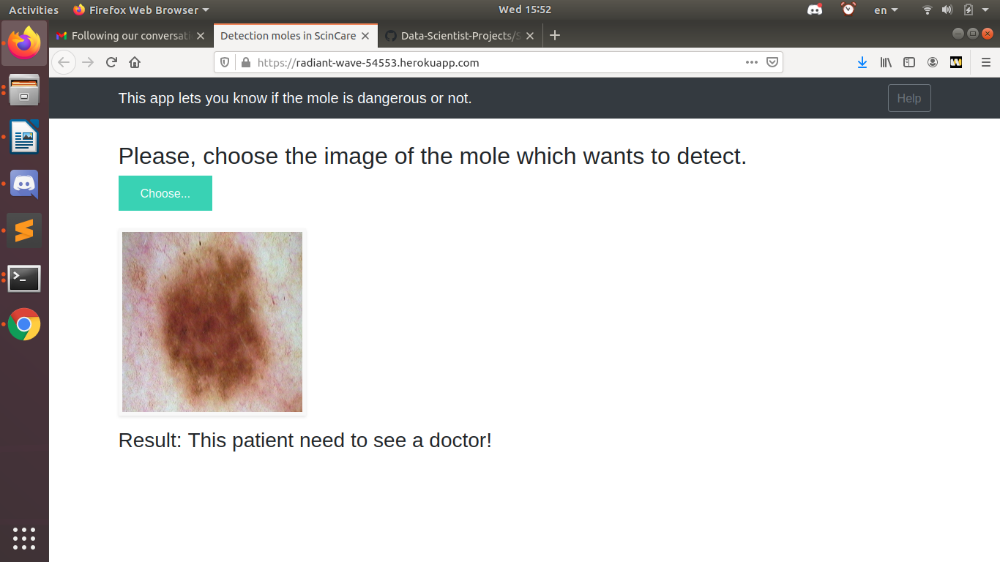
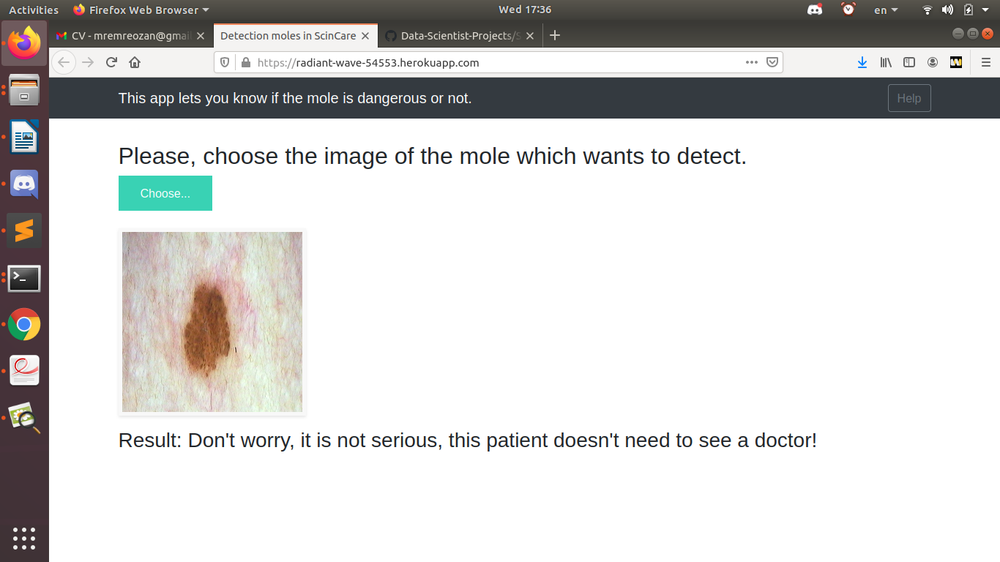

!!! Caution: [click here to see application ^^ Please wait 90 seconds (max) after click](https://radiant-wave-54553.herokuapp.com) -> 

# Mole Identification Application

Convolutional Neural Network image classifier using Keras and tensorflow backed, deployed on Heroku.


## Introduction

The team has been commissioned by the health care company "skinCare" to create an application that can detect when a mole is dangerous, and advice the user to go to see the doctor. 


## The Team
This project is a collaborative effort between four members of the *Bouwman2* promotion at [BeCode](https://github.com/becodeorg), Brussels, in January 2021. The team comprises of [Emre Ozan](https://github.com/mremreozan), [Adam Flasse](https://github.com/adamflasse), [Dilara Parry](https://github.com/trickydaze), and [Naomi Thiru](https://github.com/naomithiru)


## Project Organization

| Content | Description |
|---|---|
| Task 1 | Preparation Dataset |
| Task 2 | Importing Dataset |
| Task 3 | Creating and Saving a Model |
| Task 4 | Creating a Flask Application |
| Task 5 | Deployment and Creating a Docker File |


## Folder Structure


## Preparation of the Dataset
The downloaded data is stored in two main folders, `training_data` and `test_data`, within each, folders containing `benign` and `malignant` images. This structure is important in accessing the respective datasets and loading them for the model.
This model uses ImageGenerator to augment and prepare the data for the model.


## Creating and Saving a Model

|__Problem__|__Data__|__Methods__|__Libs__|__Link__|
|-|-|-|-|-|
|Deep Learning model|Moles dataset |CNN|`keras`, `tensorflow`,|(https://github.com/mremreozan/challenge-mole/tree/main/app)|


### Flask Application
|__Problem__|__Data__|__Methods__|__Libs__|__Link__|
|-|-|-|-|-|
|Deployment|Image input|GET, POST|`Flask`|(https://github.com/mremreozan/challenge-mole/blob/main/app/app.py)|

API recieves an image file, and returns a response of whether or not one should see a doctor.

* **Url:**
    
    https://radiant-wave-54553.herokuapp.com/

* **Method:**

  `GET` `POST`

* **Success Response:**

    ```
    
    if result == 0.0(benign):
           return "Don't worry, it is not serious, this patient doesn't need to see a doctor!"
       else:
           return "This patient need to see a doctor!"```


## Deployment

|__Problem__|__Data__|__Methods__|__Libs__|__Link__|
|-|-|-|-|-|
|Environment||Docker|`Dockerfile`, `requirements.txt`,`Procfile`, `tensorflow==2.3.2`|(https://github.com/mremreozan/challenge-mole/blob/main/app/Dockerfile)| |


In case you would like to try our API and run on container on a Web Application Service, you can do this on Heroku.
Using this documentation will help you to try our API with our environment prepared on Docker : https://github.com/mremreozan/challenge-mole/blob/main/app/Dockerfile

```
heroku login
heroku container:login
heroku create
heroku container:push web -a <heroku repository name>
heroku container:release web -a <heroku repository name>
```


## What's left
Although the model gave an accuracy of 80%, we were not able to try out some preprocssing using openCV to see if this affects its accuracy.
To further develop the CNN we could have more layers, a deeper CNN which would allow for a higher accuracy. We could also train for more epochs.


## Results (first is malignant mole, second is bening mole.)


<br>
